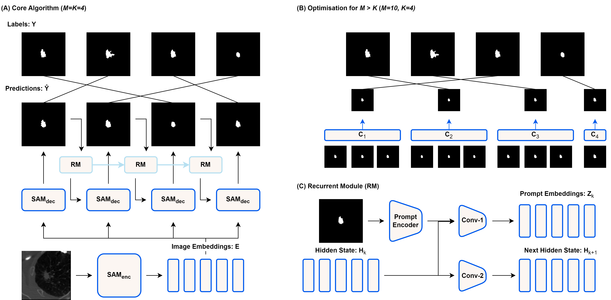

# SeqSAM: Autoregressive Multiple Hypothesis Prediction for Medical Image Segmentation using SAM

Official code for the 2025 ISBI paper: *SeqSAM: Autoregressive Multiple Hypothesis Prediction for Medical Image Segmentation using SAM*.

## Repo Overview
The repo is structured as follows. `scripts/` contains all of the files that can be run. The core functionality is contained in the `src/` folder. `src/modeling.py` contains the various models. `src/metrics.py` contains the evaluation metrics. `src/corpora.py` contains the datasets. 

## Requirements
* datasets
* monai
* numpy
* opencv-python
* torch
* transformers
* nibabel

To install relevant dependencies run:
```shell
pip install -r requirements.txt
```

## Downloading the datasets
This paper makes use of two datasets, which need to be separately downloaded.
- LIDC-IDRI can be downloaded from [here](https://github.com/stefanknegt/Probabilistic-Unet-Pytorch).
- QUBIQ-Kidney is available [here](https://qubiq.grand-challenge.org/participation/).

Downloaded content should be placed in the `data/` folder.
